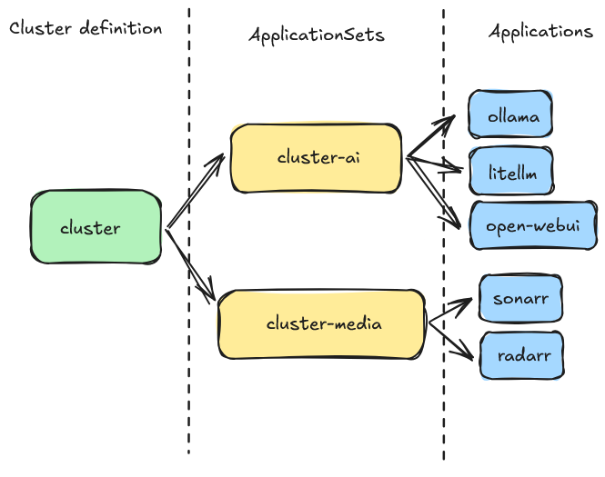

# OpenShift Application Charts Repository# OpenShift Argo CD Cluster Deployment Model


This repository contains a collection of Helm charts for deploying various applications on OpenShift/OKD clusters. The charts are organized by functional domains and designed to integrate seamlessly with OpenShift's native features.This repository implements an Argo CD-based GitOps deployment model for OpenShift/OKD clusters. It provides a structured approach to deploying and managing applications across different functional domains through a hierarchical role-based system.


## Architecture Overview## Architecture Overview


This repository focuses on individual application Helm charts that can be deployed independently or as part of a larger GitOps workflow with Argo CD.The deployment model follows a three-tier architecture:


**Charts** (`/charts`) - Individual Helm charts for each application


```text## Repository Structure

├── charts/                    # Individual application Helm charts

│   ├── ai/                    # AI/ML applications

│   │   ├── litellm/           # LiteLLM proxy for LLM management  charts/                    # Individual application Helm charts

│   │   ├── ollama/            # Local LLM runtime    ├── ai/

│   │   └── open-webui/        # Web UI for LLMs    │   ├── litellm/           # LiteLLM proxy for LLM management

│   ├── external-secrets-operator/  # External Secrets Operator    │   ├── ollama/            # Local LLM runtime

│   ├── home-automation/       # Home automation applications    │   └── openwebui/         # Web UI for LLMs

│   │   ├── home-assistant/    # Home Assistant platform    └── media/

│   │   ├── node-red/          # Node-RED flow editor        ├── bazarr/            # Subtitle management

│   │   └── zwavejs2mqtt/      # Z-Wave to MQTT bridge        └── gaps/              # Media gap detection

│   ├── infra/                 # Infrastructure components```

│   │   ├── certificates/      # Certificate management

│   │   ├── k10-kasten-operator/ # Backup and disaster recovery## How It Works

│   │   └── keepalived-operator/ # High availability load balancing

│   ├── n8n/                   # n8n workflow automation### 1. Cluster Bootstrap

│   ├── productivity/          # Productivity and utility tools

│   │   ├── bookmarks/         # Bookmark managementThe cluster bootstrap process starts by deploying the main cluster chart, which creates an Argo CD ApplicationSet that manages all defined roles.

│   │   ├── cyberchef/         # Data manipulation toolkit

│   │   ├── excalidraw/        # Collaborative whiteboard**Key file**: `cluster/values.yaml`

│   │   ├── it-tools/          # IT utility collection

│   │   └── startpunkt/        # Application dashboard- Iterates through roles defined and creates individual Argo CD Application for each role

│   └── storage/               # Storage solutions- All configuration values come from the `values.yaml` file

│       └── democratic-csi/    # CSI driver for various storage backends

├── docs/                      # Documentation and diagrams### 2. Role-Based Application Management

├── .github/                   # GitHub workflows and instructions

│   └── instructions/          # Development guidelinesEach role represents a functional domain (AI/ML, Media, etc.) and contains:

├── .devcontainer/            # Development container configuration

└── .vscode/                  # VS Code workspace settings- **Chart.yaml**: Helm chart metadata for the role

```- **Templates**: Individual Argo CD Application definitions for each app in the role


## Available Applications### 3. Application Deployment


### AI/ML ApplicationsEach application in the `/charts` directory is a complete Helm chart with:

- **LiteLLM** (`charts/ai/litellm/`) - Unified API proxy for managing multiple LLM providers

- **Ollama** (`charts/ai/ollama/`) - Local large language model runtime- **Kubernetes manifests**: StatefulSets, Services, Routes, etc.

- **Open WebUI** (`charts/ai/open-webui/`) - User-friendly web interface for interacting with LLMs- **OpenShift-specific resources**: SecurityContextConstraints, Routes

- **Integration features**: Console links, custom Application CRDs

### Home Automation- **Storage management**: PVCs with configurable storage classes

- **Home Assistant** (`charts/home-automation/home-assistant/`) - Comprehensive home automation platform

- **Node-RED** (`charts/home-automation/node-red/`) - Flow-based development tool for visual programming## Available Applications

- **ZwaveJS2MQTT** (`charts/home-automation/zwavejs2mqtt/`) - Z-Wave to MQTT bridge for home automation

### AI/ML Role

### Productivity Tools

- **Bookmarks** (`charts/productivity/bookmarks/`) - Personal bookmark management system- **LiteLLM**: Unified API proxy for managing multiple LLM providers

- **CyberChef** (`charts/productivity/cyberchef/`) - Web app for encryption, encoding, compression and data analysis- **Ollama**: Local large language model runtime

- **Excalidraw** (`charts/productivity/excalidraw/`) - Virtual collaborative whiteboard tool- **Open WebUI**: User-friendly web interface for interacting with LLMs

- **IT-Tools** (`charts/productivity/it-tools/`) - Collection of handy online tools for developers

- **Startpunkt** (`charts/productivity/startpunkt/`) - Application dashboard and homepage### Media Role


### Infrastructure Components- **Bazarr**: Subtitle management for media files

- **Certificates** (`charts/infra/certificates/`) - Certificate management and automation- **Gaps**: Tool for finding missing movies in series

- **K10 Kasten Operator** (`charts/infra/k10-kasten-operator/`) - Kubernetes backup and disaster recovery

- **Keepalived Operator** (`charts/infra/keepalived-operator/`) - High availability and load balancing### Utilities Role


### Workflow and Automation- **Excalidraw**: Whiteboard tool

- **n8n** (`charts/n8n/`) - Workflow automation tool with visual editor

- **External Secrets Operator** (`charts/external-secrets-operator/`) - Kubernetes operator for external secret management## Configuration


### Storage Solutions### Cluster Configuration

- **Democratic CSI** (`charts/storage/democratic-csi/`) - Container Storage Interface driver for various storage backends

Override parameters as needed during deployment:

## OpenShift Integration Features

```yaml

### NetworkingapiVersion: argoproj.io/v1alpha1

- **Routes**: Automatic HTTPS routes with edge termination for web applicationskind: Application

- **Services**: ClusterIP services for internal communicationmetadata:

  name: cluster

### UI Integration  namespace: openshift-gitops

- **Console Links**: Applications appear in OpenShift console application menuspec:

- **Custom Resources**: Integrated with OpenShift's custom resource definitions  destination:

    namespace: openshift-gitops

### Security    server: "https://kubernetes.default.svc"

- **SecurityContextConstraints**: Proper SCC definitions for each application  project: default

- **Service Accounts**: Dedicated service accounts with minimal required permissions  source:

- **RBAC**: Role-based access control where needed    helm:

      parameters:

### Storage        - name: config.cluster.admin_email

- **Flexible Storage**: Uses default cluster CSI driver unless specified otherwise          value: rbales79@gmail.com

- **Persistent Volumes**: Configurable PVC size and storage classes        - name: config.cluster.name

- **Backup Integration**: Kasten K10 backup annotations where applicable          value: openshift

        - name: config.cluster.timezone

## Configuration          value: America/New_York

        - name: config.cluster.top_level_domain

Each chart includes configurable values for:          value: ullberg.local

        - name: spec.source.repoURL

- **Image settings**: Repository, tag, and pull policy          value: "https://github.com/ullbergm/openshift/"

- **Resource limits**: CPU and memory requests/limits        - name: spec.source.targetRevision

- **Storage**: PVC size and storage class          value: v2

- **Networking**: Route hostnames and TLS configuration        - name: roles.utilities.enabled

- **Integration**: Console links and application metadata          value: "false"

    path: cluster

### Example Deployment with Argo CD    repoURL: "https://github.com/ullbergm/openshift/"

    targetRevision: v2

```yaml```

apiVersion: argoproj.io/v1alpha1

kind: Application## OpenShift Integration Features

metadata:

  name: open-webui### Networking

  namespace: openshift-gitops

spec:- **Routes**: Automatic HTTPS routes with edge termination

  destination:- **Services**: ClusterIP services for internal communication

    namespace: ai

    server: "https://kubernetes.default.svc"### UI Integration

  project: default

  source:- **Console Links**: Applications appear in OpenShift console menus

    helm:- **Cluster Homepage**: Startpunkt is used as the cluster homepage and every application is listed there

      parameters:

        - name: image.tag### Storage

          value: "latest"

        - name: persistence.size- **Flexible storage**: Uses the default cluster CSI driver unless a different one is specified

          value: "10Gi"- **NFS integration**: Shared storage for media applications via NFS

        - name: route.host- **Backup annotations**: Kasten backup integration

          value: "openwebui.apps.cluster.local"

    path: charts/ai/open-webui## Customization

    repoURL: "https://github.com/rbales79/argo-apps/"

    targetRevision: main### Adding a New Application

  syncPolicy:

    automated:1. Create a new Helm chart in the appropriate `/charts` subdirectory

      prune: true2. Add an Application definition in the corresponding role's templates

      selfHeal: true3. The application will be automatically deployed by Argo CD

    syncOptions:

      - CreateNamespace=true### Adding a New Role

```

1. Create a new directory in `/roles`

## Development2. Add the role to `cluster/values.yaml` roles list

3. Create Application templates for the apps in that role

### Prerequisites

- OpenShift/OKD cluster## Maintenance

- Helm 3.x

- Argo CD (optional, for GitOps workflow)- **Updates**: Renovate keeps the versions up to date


### Local Development
The repository includes a dev container configuration for consistent development environment:

```bash
# Open in VS Code with Remote-Containers extension
code .
```

### Adding New Applications
1. Create a new Helm chart in the appropriate domain directory under `charts/`
2. Follow the existing patterns for OpenShift integration
3. Include proper SecurityContextConstraints and service accounts
4. Add console links for web applications
5. Update this README with the new application

### Chart Standards
- Use semantic versioning for chart versions
- Include comprehensive `values.yaml` with comments
- Provide proper resource requests and limits
- Include health checks and readiness probes
- Follow OpenShift security best practices

## Maintenance

- **Automated Updates**: Renovate bot keeps application versions current
- **Security Scanning**: Regular security scans for vulnerabilities
- **Documentation**: Keep README and chart documentation updated

## Contributing

1. Fork the repository
2. Create a feature branch
3. Make your changes following the established patterns
4. Test your changes on an OpenShift cluster
5. Submit a pull request

## Maintainer

- **Roy Bales** - rbales79@gmail.com

## License

This project is licensed under the MIT License - see the individual chart directories for specific licensing information.
